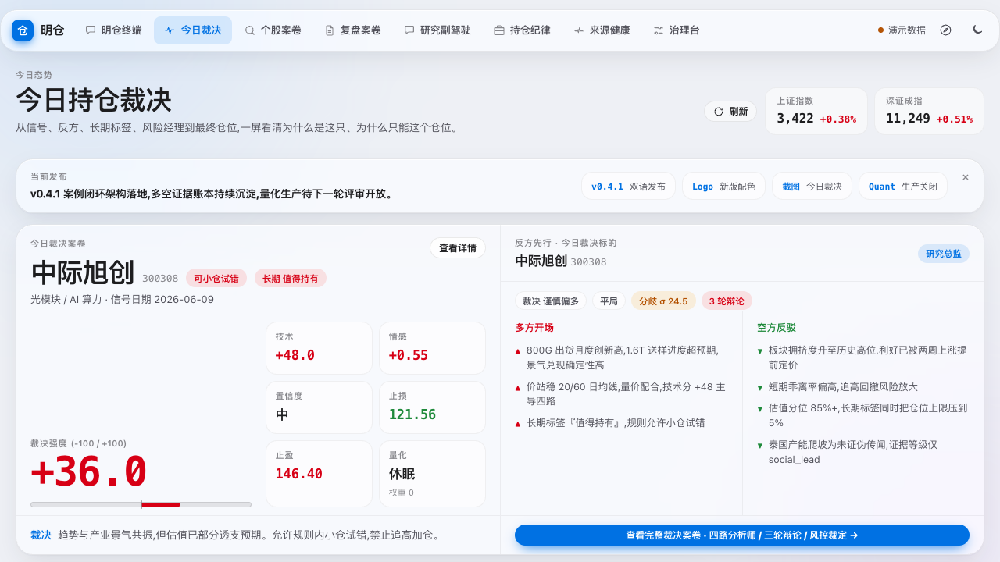
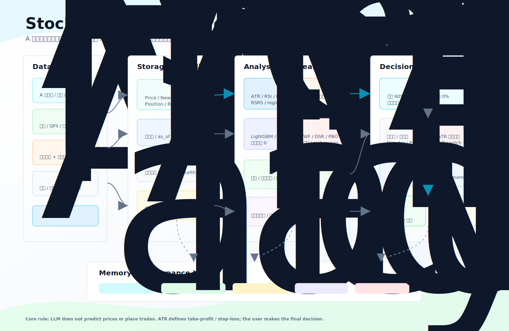

# 明仓 · MingCang

> **本地优先的 A 股研究 Agent**：把研究、信号、持仓纪律、复盘和记忆串成一套可对话的个人研究工作台。

明仓不是量化交易系统，也不是 AI 选股器。它不承诺收益、不替你下单、不替你拍板；它做的是把你关心的股票、赛道、观点、风险和复盘结果组织起来，让 AI 帮你扩大扫描半径、反驳假设、补齐证据，并把被结果验证过的经验沉淀成记忆。

**当前推荐用法：打开明仓 Agent，直接用自然语言和它对话。** 由于明仓近期做了大规模重构，前端版本还在体验优化中，更适合作为本地可视化查看入口；日常研究、复盘、关注列表维护和风险检查，优先推荐走 agent 方式。

[](https://zeeechenn.github.io/MingCang/)
[](https://github.com/Zeeechenn/MingCang/actions/workflows/test.yml)
[](https://github.com/Zeeechenn/MingCang/releases)


**在线文档**：<https://zeeechenn.github.io/MingCang/> ｜ **语言**：[简体中文](README.md) · [English](README_EN.md)

---

## 30 秒看懂

- **研究入口**：你用自然语言提问，明仓自己调度本地研究、信号、记忆和风险上下文。
- **日常节奏**：盘前扫风险，盘中记录异动，盘后整理信号、新闻、止损线和待复核事项，周末做体检。
- **决策边界**：AI 帮你扫广度、挑毛病、找证据；最终判断、仓位和交易动作始终由你决定。
- **数据边界**：默认本地优先，行情、新闻、持仓、复盘和记忆保存在你自己的电脑上；远程能力需要显式配置。
- **当前形态**：Agent 体验优先；前端仍在大改后的产品化打磨中，不建议把前端当作当前主入口。

---

## 你可以直接这样说

| 你想做什么 | 直接对明仓说 |
|---|---|
| 研究一只股票 | “帮我看一下 300308，现在适合观察、试错还是规避？” |
| 盘前检查 | “盘前扫一遍我的关注列表，告诉我今天先看哪些风险。” |
| 盘后复盘 | “收盘后复盘一下今天的信号、新闻和需要跟进的票。” |
| 维护关注列表 | “把中际旭创加进关注列表，后面每天帮我盯着。” |
| 跟踪一个主题 | “把光模块 1.6T 需求作为长期论题跟踪，列出失效条件。” |
| 喂一个观点 | “我看到一个观点：先进封装可能加速，把它归档并帮我找反证。” |
| 复盘一笔交易 | “复盘这次宁德时代亏损，看看有没有能沉淀成规则的东西。” |
| 查看记忆 | “过去我在半导体票上踩过哪些坑？下次研究时提醒我。” |

明仓会把这些自然语言请求转成它自己的本地工具调用。你不需要记底层入口，也不需要理解内部模块名。

---

## 快速开始

### 推荐：安装 Agent 入口

```bash
curl -fsSL https://raw.githubusercontent.com/Zeeechenn/MingCang/main/scripts/install.sh | sh
mingcang
```

启动后直接和它说人话即可，例如：

```text
帮我看一下 300308，结合信号、新闻、长期标签和过去的记忆，给我一个研究结论。
```

默认本地模式优先使用你本机已登录的本地 AI 工具。只有启用特定云端模型、搜索或数据源能力时，才需要配置对应 key。

### 可选：本地 Web 工作台

前端提供研究总览、标的检索、案卷、持仓、日常报告、记忆和治理工作台。想先体验完整流程，可以运行独立 demo：

```bash
git clone https://github.com/Zeeechenn/MingCang.git
cd MingCang
make demo
```

然后打开 <http://127.0.0.1:5173>。demo 数据和真实数据严格分开，界面会持续标明数据模式；demo 只用于体验流程，不代表你的真实关注列表、持仓或研究结论。需要连接本地后端时，按开发模式启动 API 与前端即可。



---

## 信号卡示例

```
  600584 长电科技                                   2026-06-02
  ────────────────────────────────────────────────────────────
  综合分 25.8          建议  🟡 可小仓试错
  技术 28.6  ·  量化 25.8  ·  新闻情感 +18.0
  止损 64.66    止盈 98.17    (ATR 2.5 移动止损)
  ────────────────────────────────────────────────────────────
  rule: aggregate_v1  ·  数据不出本机
```

当日批量信号：

| 代码 | 名称 | 综合分 | 建议 | 技术 | 量化 | 新闻情感 | 止损 | 止盈 |
|---|---|---:|---|---:|---:|---:|---:|---:|
| 600584 | 长电科技 | **25.8** | 🟡 可小仓试错 | 28.6 | 25.8 | +18.0 | 64.66 | 98.17 |
| 603986 | 兆易创新 | 4.3 | 🔵 可关注 | 26.4 | 4.5 | −55.2 | 414.86 | 603.09 |
| 300750 | 宁德时代 | −1.7 | ⚪ 观望 | −12.5 | 1.3 | +18.0 | 397.42 | 488.68 |

信号只给分档建议和 ATR 风险线，不预测涨跌，不喊必涨。新闻情感是研究辅助输入，不能单独作为买卖依据。

---

## 核心能力

| 能力 | 说明 |
|---|---|
| Agent 对话入口 | 把股票研究、关注列表、日常扫描、复盘和记忆查询统一成自然语言交互。 |
| 每日信号与风险线 | 技术因子、新闻情感、质量旗标和 ATR 移动止损共同构成每日纪律参考。 |
| 研究框架分析师团 | 财务质量、景气变化、供应链核查等成熟框架用于长期研究，不直接替代每日信号。 |
| 案卷式闭环 | 研究、信号、持仓、复盘和记忆互相链接，方便回溯“当时为什么这么判断”。 |
| 本地数据底座 | SQLite、缓存契约、数据质量门和防未来函数机制，减少脏数据和回看偏差。 |
| 记忆系统 | 只把被结果验证、复盘确认的经验升级为可信记忆，避免把“听起来对”当成真理。 |
| 前端工作台 | 可视化查看案卷、信号、复盘和来源健康；当前仍在产品体验优化中。 |

---

## 案例：一笔亏损如何沉淀成规则

明仓把研究做成一条闭环：判断 → 信号 → 持仓 → 复盘归因 → 记忆更新。下面是一笔纸上交易记录。

**宁德时代（300750）· 2026-05 · 纸上交易**

| 步骤 | 记录 |
|---|---|
| 入场 | 05-14 @ 449.38，止损 395.57 |
| 持仓 | 信号持续转弱；当时无“信号反转退出”规则，继续持有 |
| 平仓 | 05-25 @ 411.28，亏损 −8.48% |
| 复盘归因 | 根因：缺少信号反转退出规则 |
| 沉淀改进 | 据此新增“信号反转退出”规则，并等待后续结果验证 |

完整链路见 [宁德活样本](docs_public/ningde_live_sample.md)。

这个案例体现了明仓的核心哲学：**亏一笔不可怕，可怕的是没沉淀成规则。** 复盘归因找到根因，经人工确认后升级成可信记忆，下次不再犯同样的错。

---

## 纸上交易结果

```
  📒 纸上交易最终复盘                2026-05-12 ~ 06-01
  ────────────────────────────────────────────────────────────
  7 笔全平 · 每笔 20% 仓
  仓位加权合计  +3.79%          7 只合计  +18.94%
  ────────────────────────────────────────────────────────────
  盈利 2 笔    兆易创新 +34.26%   ·   长电科技 +11.33%
  止损 5 笔    平均 −5.33%（最大 −9.20%）

  盈亏比 ≈ 4.3 : 1（均盈 +22.8% / 均亏 −5.3%）
  ────────────────────────────────────────────────────────────
  纸上交易回放 · 非真金白银 · 历史结果不回改
```

纸上交易只是验证研究流程和风险纪律的方式，不等于真实收益，也不构成投资建议。

---

## Agent 接入

明仓的主入口是本地 agent。你可以使用内置的 `mingcang` Pi 终端，也可以让 Claude Code、Codex、Cursor 等外层 agent 读取项目规则后调用明仓能力。

外层 agent 接入时默认先读 [AGENTS.md](AGENTS.md)，再按需读取 [STATUS.md](STATUS.md)、[PROJECT.md](PROJECT.md) 和公开文档。写入关注列表、记忆、配置或远程接口时，遵循本地/远程边界和 dry-run 规则。

核心上下文工具包括：

| 工具 | 用途 |
|---|---|
| `mingcang_project_context` | 持仓、自选、记忆摘要、配置概况 |
| `mingcang_stock_context` | 单只股票：信号、新闻、标签、研究 copilot 影子结论 |
| `mingcang_memory_snapshot` | 分层记忆、审计日志、记忆促进状态 |
| `mingcang_health` | 数据库、依赖、权限健康检查 |

---

## 深入了解

这一节给想理解底层设计的人。日常使用只需要和 agent 对话，不需要先理解这些术语。

### 研究框架分析师团

明仓把一批成熟研究方法编码成可复用的分析师模块，各自从不同维度给一只票做长期判断，再加权融合：

| 分析师 | 方法论来源 | 看什么 |
|---|---|---|
| 📊 **Piotroski F-Score** | 经典学术 9 因子 | 财务质量：盈利、杠杆、经营效率 |
| 📈 **景气分析师** | 开源证券《景气投资方法论》框架 | 利润、收入、ROE 等指标的边际变化 |
| 🔗 **赛道供应链分析师** | 产业链景气与供应链核查 | 科技/硬件赛道的领先指标、周期位置和炒作过滤 |
| 🧭 **Serenity 瓶颈框架** | Serenity chokepoint skill / 报告门方法论 | 供应链瓶颈、证据等级、非共识线索和反方问题；当前作为研究检查清单与报告门加严层，不接管生产信号 |

这些框架属于长期研究层，给的是赛道与个股的中长期判断，不直接改每日信号。每日信号仍由明确规则、风险线和证据门槛约束。

### LLM 辩论与裁量增强臂

明仓确实有 LLM 层，但它的位置是**研究裁量与反方审视**，不是自动买卖。

| 能力 | 做什么 | 边界 |
|---|---|---|
| 多轮 LLM 辩论 | Director 提出争议点，Researcher 做多空辩论或快速共识，RiskManager 做风险否决和降级。 | 输出研究分歧、反证和风险，不直接改官方信号。 |
| LLM 裁量增强臂 | 围绕候选内排序、试错/观察倾向、持仓去留、降仓/离场倾向、加减仓时机和复盘提炼生成裁量参考卡。 | 默认灰度关闭；开启后也是 observe-only，不修改止损、止盈、仓位或官方信号。 |
| 反方审视 | 对每张裁量卡找最强反驳，检查证据遗漏和推理跳跃。 | 只做审视，不替用户下结论。 |

所以更准确的说法不是“LLM 直接买入、卖出、选股”，而是：**LLM 参与候选比较、持仓去留解释、时机判断和复盘归因，但必须在规则信号、ATR 风险线和人工确认边界内工作。**

### 数据底座

| 能力 | 做什么 |
|---|---|
| 多源与自动回退 | provider 注册表，主源失败后按冷却策略切换备源。 |
| 防未来函数 | 回看和验证只使用当时可见的数据，避免用未来信息“作弊”。 |
| 质量门与覆盖度报告 | 校验价格、财务、新闻和来源覆盖，脏数据会进入预警。 |
| 缓存与新鲜度策略 | 声明式缓存契约，控制何时允许复用本地缓存、何时需要刷新。 |

信号和研究再好，数据不干净就是空中楼阁。明仓把每一次判断尽量落到可追溯、可复核的数据上。

### 研究决策闭环

明仓把研究模型做成案卷式闭环：用四类 Case 把研究、信号、持仓、复盘串成一条链路，彼此可链接、可审计。



```
进口（数据 + 新闻 + 你的判断 + 外部论题）
        │
        ▼
  ResearchCase ──▶ SignalCase ──▶ PositionCase ──▶ ReviewCase
   为什么值得研究    现在能交易吗     为何持有/何时退      结果教会了什么
        ▲                                                  │
        └────────── 记忆更新（outcome-gated，人工确认）◀────┘
```

说人话就是：先记下“为什么值得研究”，再判断“现在能不能交易”，交易后记录“为何持有/何时退出”，结果出来后复盘“这次教会了什么”。被结果验证过、经人工确认的经验，才会进入可信记忆。完整架构见 [docs/ARCHITECTURE.md](docs/ARCHITECTURE.md)。

### 当前能力状态

| 能力 | 当前状态 |
|---|---|
| 盘后风险面板 | 已能把风险警示、再评估触发、ATR 距离、财务质量和数据质量放进同一个复盘视图。 |
| 观察哨与触发器 | 已能记录关注标的的价格、资金、新闻和主题联动变化，触发后进入待复核队列。 |
| 日常报告 | 已覆盖盘前、盘中、盘后和周末体检，报告层会尽量把内部术语翻成可执行的研究问题。 |
| LLM 裁量层 | 有候选比较、持仓去留、时机解释和复盘提炼能力；默认灰度关闭，开启后也只输出参考卡。 |
| 盲裁验收 | 判断类功能可以做跨模型盲裁和前向验证，避免“换个更强模型就直接改生产信号”。 |
| Web 前端 | 已覆盖研究、标的检索、案卷、持仓、日常报告、记忆与治理；真实/降级/demo 状态持续可见，写操作有确认边界，桌面和移动端流程均纳入浏览器回归。 |

---

## 配置

<details>
<summary><b>本地与远程配置</b></summary>

真实 key 只放本机 `.env` 或部署平台的 secret manager，不要提交到 Git。可以从 `.env.example` 复制一份开始：

```env
AI_PROVIDER=local_cli
DATABASE_URL=sqlite:////absolute/path/to/mingcang.db
MINGCANG_AGENT_MODE=local
```

默认本地模式使用 `AI_PROVIDER=local_cli`，优先走本机已登录的本地 AI 运行时，不需要云端 LLM key；行情/新闻默认走东财等免 key 源。**零 key 也能跑通基础流程**，但有一个前置条件：本机已登录可用的 AI CLI（`claude` 或 `codex`）。没有的话，`ANTHROPIC_API_KEY` / `OPENAI_API_KEY` 必须二选一。

必要性分三档：**必须**（不配跑不起来对应模式）、**⭐推荐**（想顺利用全明仓的研究/新闻能力就该配）、可选（按需）。

| 变量 | 必要性 | 何时填写 | 获取地址 | 费用 |
|---|---|---|---|---|
| `ANTHROPIC_API_KEY` | 二选一必须（无本机 AI CLI 时） | `AI_PROVIDER=anthropic` | [console.anthropic.com](https://console.anthropic.com/) | 付费按量 |
| `OPENAI_API_KEY` | 二选一必须（无本机 AI CLI 时） | `AI_PROVIDER=openai` | [platform.openai.com](https://platform.openai.com/api-keys) | 付费按量 |
| `OPENAI_BASE_URL` | 可选 | 使用 OpenAI 兼容网关时 | 留空表示 OpenAI 官方地址 | — |
| `IFIND_MCP_TOKEN` | ⭐推荐 | `IFIND_MCP_ENABLED=true`；**新闻/公告的生产主源**，不配则新闻层退化到东财兜底、公告与历史新闻回填不可用 | [mcp.51ifind.com](https://mcp.51ifind.com/)（同花顺 iFinD MCP） | 有免费档（日/月双层限额），个人付费档更宽 |
| `TAVILY_API_KEY` | ⭐推荐 | 实时新闻/搜索兜底与 deep research 检索 | [tavily.com](https://www.tavily.com/) | 有免费月度额度 |
| `TUSHARE_TOKEN` | 可选 | 需要 Tushare Pro A 股数据补充时 | [tushare.pro](https://tushare.pro/register) | 免费注册，积分制解锁接口 |
| `TICKFLOW_API_KEY` | 可选 | `TICKFLOW_ENABLED=true` | [tickflow.org](https://tickflow.org/) | 有免费额度 |
| `ANSPIRE_API_KEY` | 可选 | deep research 或严格事件新闻抓取 | [anspire.cn](https://www.anspire.cn/) | 付费充值按量 |
| `BARK_KEY` | 可选 | 需要 iOS Bark 推送时 | [Bark iOS App](https://github.com/Finb/Bark)（App 内自动生成设备 key） | 免费 |
| `MINGCANG_AGENT_API_KEY` | 远程模式必须 | `MINGCANG_AGENT_MODE=remote`；本地模式不需要 | 自行生成任意强随机串，非第三方申请 | — |

远程暴露是 opt-in，默认只读：

```env
MINGCANG_AGENT_MODE=remote
MINGCANG_AGENT_API_KEY=your_secret_key
MINGCANG_AGENT_REMOTE_WRITE_ENABLED=false
MINGCANG_AGENT_REMOTE_WRITE_ACTIONS=
```

`.env`、数据库、个人交易记录、真实 key 不进 Git。

</details>

---

## 文档索引

| 文件 | 内容 |
|---|---|
| [docs_public/index.md](docs_public/index.md) | 公开文档首页：推荐导航、最短路径、核心能力 |
| [docs_public/USER_GUIDE.md](docs_public/USER_GUIDE.md) | Agent 使用指南：以自然语言完成单股研究、每日扫描、长期论题和复盘记忆 |
| [docs_public/FEATURE_MAP.md](docs_public/FEATURE_MAP.md) | 功能目录：每个功能的说明、入口、状态、写入/信号/Key 边界 |
| [docs_public/DEVELOPER_GUIDE.md](docs_public/DEVELOPER_GUIDE.md) | 后续开发指南：页面、API、action、研究模块、量化模块 |
| [docs_public/REFERENCE.md](docs_public/REFERENCE.md) | 参考手册：底层接口、配置和关键文件 |
| [AGENTS.md](AGENTS.md) | Agent 使用规则和安全边界 |
| [PROJECT.md](PROJECT.md) | 代码库导航和关键文件索引 |
| [STATUS.md](STATUS.md) | 当前生产状态、信号权重、测试入口 |
| [CHANGELOG.md](CHANGELOG.md) | 版本历史和已完成更新 |
| [CONTRIBUTING.md](CONTRIBUTING.md) | 开发环境和贡献流程 |
| [docs/ARCHITECTURE.md](docs/ARCHITECTURE.md) | 分层架构、Case 类型、融合逻辑完整说明 |
| [docs/WHY_NOT_AI_STOCK_PICKER.md](docs/WHY_NOT_AI_STOCK_PICKER.md) | 为什么明仓不是 AI 选股器：LLM 边界、ATR 纪律、记忆门控 |

---

## 许可证与声明

明仓当前版本采用 [PolyForm Noncommercial License 1.0.0](LICENSE)：允许个人研究、学习、实验和非商业组织使用、修改与分发；**不允许未经授权的商业使用、商业集成、商业托管或再销售**。商业合作或授权请先联系维护者。

早期已经按 MIT License 获取的副本仍以其当时附带的许可文本为准；当前仓库和后续版本不再按 MIT 发布。

明仓是个人研究工具，**不构成投资建议**。系统不自动下单，LLM 不做价格预测，止盈止损由 ATR 公式和风险约束生成。所有交易决策和资金风险由使用者自行承担。

---

## 未来方向

明仓的愿景是：**让 AI 放大你的判断，而不是替你拍脑袋。**

- **继续强化 agent-first 使用方式**：让用户用自然语言完成研究、复盘、关注列表和记忆查询，而不是学习一组内部入口。
- **继续打磨前端体验**：前端会从“能看”走向“好用”，但当前主推仍是 agent。
- **用真实结果激活新能力**：新模型、新因子、新框架都要先通过前向样本、数据质量和复盘验证，再影响生产判断。
- **验证 A/HK/US 多市场链路**：A 股正式链保持不变；港股和美股已具备可跟踪、可研究、可回放的完整影子链，先在小池灰度积累证据，过门后才考虑扩池。
- **只记住被验证过的经验**：一条判断对不对，要等结果出来、复盘通过才算数，不会因为“讲得有道理”就被写进可信记忆。
