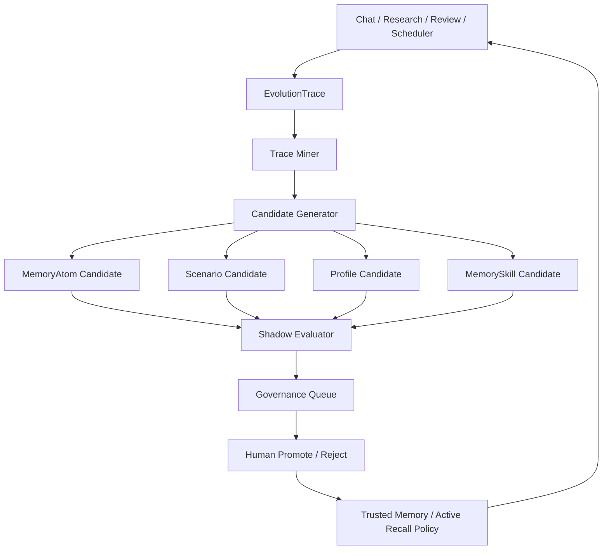

> 归档说明:本方案 2026-07-03 被采纳为 **M57**(原文建议的 M55/M56 编号已被占用)。
> MVP 范围与边界以 docs/ROADMAP.md M57 行为准:不需用户手动调用、不参与打分、只参与提示。

# 明仓记忆系统自进化优化方案

> 版本：v0.2 draft  
> 日期：2026-07-02（本机环境 Asia/Singapore）  
> 目标：把明仓现有“分层记忆 + 复盘促进”升级为“可持续观察、自动提案、人工确认、评测驱动、上下文可控”的自进化记忆系统。  
> 结论先行：明仓应该做“自进化候选系统”，而不是“自动自我授权系统”。

> v0.2 修订重点：把“记忆越来越臃肿、上下文越塞越多导致 AI 降智”的问题提升为核心架构约束；新增 Context Governor、Task Capsule、新会话承接协议、分层 token 预算和两段式召回。

---

## 1. 一句话判断

明仓现在已经有“会成长的记忆系统骨架”：`ai_memory`、`stock_memory_items`、`memory_atoms`、`memory_scenarios`、`memory_profiles`、`MemoryPromotionCandidate`、聊天摘要、审计和 L0-L4 架构都已经存在。

但它还没有真正的“自动进化”：没有持续从用户行为、复盘结果、失败案例、召回效果、确认/拒绝反馈中自动归纳画像、策略、记忆技能，也没有一套评测门来决定哪些记忆策略值得提升。

最合理的升级方向是：

```text
使用过程 / 研究结果 / 复盘结果 / 用户确认
        ↓
EvolutionTrace 原始轨迹层
        ↓
自动提炼候选：MemoryAtom / Scenario / Profile / MemorySkill / PromptPolicy
        ↓
shadow 评测 + 安全门 + 可解释 diff
        ↓
人工确认
        ↓
trusted memory / active policy
        ↓
下一轮研究与对话召回
```

这和明仓现有定位完全一致：AI 是 amplifier，不是 oracle；学习必须 outcome-gated，不是 plausibility-gated。

但还要补一条同等重要的原则：

> 明仓的记忆系统不是“把历史塞进 prompt”，而是“把历史压缩成可审计索引，在任务需要时按预算取出最少、最准的一小段”。

自进化的目标不是让上下文变长，而是让新对话在极短上下文里继承上次任务的关键状态。

---

## 2. 当前真实状态

### 2.1 已经有的能力

明仓现在已经具备几个关键底座。

| 能力 | 当前位置 | 意义 |
|---|---|---|
| 长期 key-value 记忆 | `backend/memory/ai_memory.py` | 存规则、偏好、风险、研究索引 |
| 个股结构化记忆 | `backend/memory/stock_memory.py` | 存 thesis、risk、event、research_pointer、user_preference |
| L0 原子记忆 | `backend/memory/l0_memory.py` | 支持 raw / pending / trusted / refuted 分层 |
| 场景聚合 | `memory_scenarios` | 适合把多个 atom 聚成一个“情景” |
| 用户/方法画像 | `memory_profiles` | 适合存用户偏好、研究方法、风险习惯 |
| 复盘候选 | `MemoryPromotionCandidate` | pending → trusted/rejected 的促进门 |
| 聊天摘要 | `backend/memory/summarizer.py` | 长会话自动压缩窗口上下文 |
| 记忆召回 | `build_memory_context` / `build_l0_context` | 自动把相关记忆注入研究和聊天 |
| 审计 | `audit_log_fts` / `audit_write` | 可追踪写入、召回、促进 |
| 前端候选确认 | `/research/memory-candidates/{id}/promote|reject` | 人工促进可信记忆 |

### 2.2 现在缺的能力

当前缺口不在“有没有表”，而在“有没有闭环”。

| 缺口 | 具体表现 |
|---|---|
| 自动采样不足 | 没有统一记录“本次对话/研究用了哪些记忆、结果怎样、用户是否认可” |
| 自动提案不足 | 不会从多轮使用中提炼新的 `memory_profiles`、`memory_scenarios` 或记忆技能 |
| 用户隔离不足 | 现有 schema 有 `scope/profile_key`，但没有明确 `user_id/tenant_id/persona_id` 边界 |
| 评测不足 | 没有对“新记忆策略是否改善回答/研究质量”做 shadow A/B |
| skill 进化不足 | 没有“怎么记、记什么、什么时候忘、怎么召回”的 meta-memory skill bank |
| 前端治理不足 | 用户看不到“系统为什么认为这条应进化、用了哪些证据、可能影响什么” |
| 启用门不足 | 没有明确从 candidate → active policy 的 promotion gate |

### 2.3 本次实测快照

本次运行 `python3 -m backend.agent.cli memory-snapshot --pretty` 的结果显示：

```text
ai_memory_count = 0
stock_memory_items_count = 0
memory_atoms_count = 0
memory_scenarios_count = 0
memory_profiles_count = 0
decision_memory_layered_count = 0
audit_log_count = 0
chat_sessions_count = 0
~/.mingcang/memory/*.md = 50 个 markdown 旧式记忆文件
```

这说明当前默认库里“结构化记忆闭环”没有活跃数据；但旧式 markdown 记忆存在。第一阶段不能直接做复杂自进化，必须先把轨迹、审计、旧记忆迁移和可见性补齐。

---

## 3. 外部项目给明仓的启发

本方案参考了几个方向，但只借鉴机制，不照搬框架。

| 项目 | 可借鉴点 | 明仓中的转译 |
|---|---|---|
| DGM / Darwin Godel Machine | 自改代码必须用 benchmark 验证，每次变更有实验日志 | 明仓不能自改生产决策；可以自动生成候选 patch，但必须 `make verify` + 金融安全评测 + 人工确认 |
| OpenEvolve | 进化循环 = 候选生成 + evaluator + 多目标评分 + 可视化 | 明仓的 evaluator 应是 recall precision、用户确认率、复盘命中率、风险提前发现率 |
| MemSkill | 进化的不是记忆内容，而是“记忆技能”：提取什么、保留什么、如何召回 | 明仓应建立 `memory_skills`：比如“卖飞复盘提取规则”“财务偏好提取规则”“赛道研究员观点跟踪规则” |
| MemOS | L1 trace、L2 policy、L3 world model、crystallized skills、多用户隔离、反馈修正 | 明仓可做轻量版：Trace → Policy/Profile → Scenario/World Model → Skill Candidate |

关键判断：明仓是金融研究系统，不能追求完全 autonomous self-modification。它应该追求“自动发现可复用经验，并以低风险方式提案”。

---

## 4. 设计原则

### 4.1 不自动提升可信度

任何 LLM 产物、聚合结论、用户行为推断，默认最多进入 `raw` 或 `pending`。

只有以下路径能成为 `trusted`：

1. 用户显式确认；
2. ReviewCase outcome 归因完成；
3. 通过预设评测门；
4. 本地人工确认 promotion。

### 4.2 不自动影响 official signal

自进化记忆可以影响：

- 研究上下文；
- 问题提醒；
- 风险 checklist；
- 复盘候选；
- 报告结构；
- 个性化展示。

自进化记忆不能直接影响：

- official signal；
- 仓位；
- 止损/止盈；
- scheduler 生产动作；
- test2/test4 试验状态；
- 情感权重或生产 profile。

### 4.3 先让系统看得见，再让系统会学习

第一阶段不要急着“自进化”。先补 trace 和 dashboard，让明仓知道：

- 哪些记忆被召回；
- 哪些被用户采纳；
- 哪些导致噪声；
- 哪些重复出现；
- 哪些风险被系统提前提醒；
- 哪些问题每次都需要用户补充。

### 4.4 进化对象分层

不要把所有东西都叫 memory。

| 层级 | 名称 | 是否可自动生成 | 是否可自动生效 |
|---|---|---:|---:|
| L1 | trace / raw event | 是 | 否 |
| L2 | memory atom candidate | 是 | 否 |
| L3 | scenario/profile candidate | 是 | 否 |
| L4 | memory skill candidate | 是 | 否 |
| L5 | active recall policy | 否，需评测+确认 | 否，需人工确认 |
| L6 | code/prompt patch | 可生成 PR 草稿 | 绝不自动合并 |

---

## 5. 目标架构

### 5.1 新增模块概览

```text
backend/memory/
  evolution_trace.py          # 原始使用轨迹记录
  evolution_miner.py          # 从轨迹中挖候选
  evolution_evaluator.py      # shadow eval / replay / 指标
  memory_skills.py            # meta-memory skill bank
  memory_governance.py        # promotion gate / reject / archive
  context_governor.py         # 召回预算、压缩、分层注入、降智防护
  task_capsule.py             # 每次任务结束后的可承接任务胶囊

backend/jobs/
  memory_evolution.py         # 周期性自进化候选生成 job

backend/api/routes/
  memory_evolution.py         # 前端读取候选、diff、评测、确认

frontend/src/
  page-memory-evolution.tsx   # 记忆进化治理台
```

### 5.2 新增数据流



### 5.3 核心思想

自进化不是“模型自己觉得应该改”，而是：

1. 记录真实行为；
2. 找到重复模式；
3. 形成候选；
4. 用回放/评测证明候选有用；
5. 用户确认；
6. 进入下一轮上下文。

---

### 5.4 上下文经济与新会话承接

这是 v0.2 必须新增的核心约束。

明仓作为 AI agent，不应该依赖“同一个超长对话一直滚下去”。正确形态应该是：

```text
每次任务可以开新对话
        ↓
系统读取极短的项目规则 + 用户画像 + 相关任务胶囊
        ↓
必要时按需 drilldown 到原始证据
        ↓
任务结束时写回新的任务胶囊和候选记忆
        ↓
下一次新对话继续接上，但上下文不膨胀
```

也就是说，记忆系统要同时承担两类功能：

1. **长期记忆**：用户偏好、研究方法、个股教训、风险纪律；
2. **任务连续性**：上一次做到了哪里、下次从哪里继续、哪些结论已确认、哪些仍是 pending。

如果只做长期记忆，不做任务连续性，新对话会“断片”；如果只把上次全文塞进去，新对话会“降智”。所以要新增 `TaskCapsule`。

#### 5.4.1 Task Capsule

每次较完整的 agent 任务结束时，生成一个短胶囊，而不是保存整段对话。

建议字段：

| 字段 | 说明 |
|---|---|
| `capsule_id` | 任务胶囊 id |
| `task_type` | research / review / coding / planning / data_refresh / report |
| `user_id` | 默认 `owner` |
| `symbols_json` | 涉及股票 |
| `themes_json` | 涉及主题/赛道 |
| `goal` | 本次任务目标，一句话 |
| `confirmed_facts` | 已确认事实，最多 5 条 |
| `decisions` | 用户/系统已做决定，最多 5 条 |
| `open_loops` | 未完成事项，最多 5 条 |
| `next_actions` | 下次继续时应该先做什么 |
| `used_memory_refs` | 本次用过的记忆 |
| `artifact_refs` | 报告、PR、日志、评测结果路径 |
| `trust_state` | draft / pending / confirmed |
| `token_estimate` | 胶囊大小 |
| `created_at` | 时间 |

胶囊原则：

- 默认 300-800 中文字；
- 最多保留 5 条关键事实、5 条决策、5 条 open loops；
- 不存完整对话；
- 不存密钥、原始长报告、全量 SQL 输出；
- 可以 drilldown 到 artifact，但不会默认注入 artifact 全文。

#### 5.4.2 新会话启动协议

新对话不应该加载所有历史。启动时只做四步：

```text
1. 识别任务：用户这次要研究、复盘、写代码、查数据，还是继续某个任务？
2. 读取极短根上下文：项目边界 + 用户 profile + 当前任务意图。
3. 检索 0-3 个相关 TaskCapsule。
4. 若仍不够，再按需读取具体 memory atom / report / DB。
```

默认注入预算建议：

| 上下文块 | 默认预算 | 说明 |
|---|---:|---|
| Root rules | 300-600 tokens | 明仓红线、当前模式、不可自动交易 |
| User profile | 300-800 tokens | 只放与任务相关偏好 |
| Task capsules | 500-1500 tokens | 0-3 个最相关胶囊 |
| Symbol/theme memory | 800-2000 tokens | 个股/主题相关，不含全文 |
| Pending warnings | 0-400 tokens | 只提示，不当事实 |
| Drilldown evidence | 按需追加 | 用户问到或 agent 判断必须查证时再读 |

硬规则：

- 记忆默认不超过本轮 prompt 预算的 25%-35%；
- pending/raw 默认不超过记忆预算的 15%；
- 单条 memory 超过 500 tokens 必须先摘要；
- 超过预算时优先丢弃 raw/pending、低置信、过期、低命中记忆；
- 任何时候都不要为了“完整”塞入全文历史。

#### 5.4.3 Context Governor

新增 `context_governor.py`，作为所有记忆召回进入 prompt 前的最后一道门。

职责：

1. 估算 token；
2. 按任务类型分配预算；
3. 对候选记忆排序；
4. 把长记忆压缩成 brief；
5. 分层打包；
6. 输出 provenance；
7. 当预算不足时返回“需要 drilldown 的引用”，而不是强行塞全文。

伪代码：

```python
def build_agent_context(task, query, symbol=None, user_id="owner"):
    budget = allocate_budget(task)
    root = root_rules_brief(task, budget.root)
    profile = retrieve_user_profile(user_id, query, budget.profile)
    capsules = retrieve_task_capsules(user_id, query, symbol, budget.capsules)
    memories = retrieve_memory_briefs(symbol, query, budget.memory)
    packed = pack_by_priority([root, profile, capsules, memories], budget.total)
    return {
        "text": packed.text,
        "provenance": packed.refs,
        "omitted": packed.omitted_refs,
        "drilldown_available": packed.drilldown_refs,
        "token_estimate": packed.token_estimate,
    }
```

#### 5.4.4 两段式召回

为了避免“先塞再说”，所有复杂任务改为两段式：

```text
Stage A：轻量启动
  - root rules
  - user profile 摘要
  - task capsule 摘要
  - 最多 3-5 条相关 memory brief

Stage B：按需展开
  - 用户要求详情
  - agent 发现证据不足
  - 需要复核关键判断
  - 需要生成报告/代码/交易前检查
```

这让新对话既能承接上次，又不会一开始就塞入长上下文。

#### 5.4.5 记忆生命周期

记忆不是越多越好，必须有生命周期：

```text
raw trace
  → short-lived session fact
  → task capsule
  → memory atom candidate
  → scenario/profile rollup
  → trusted compact memory
  → stale/archive/refute
```

保留策略：

| 类型 | 默认策略 |
|---|---|
| 原始 trace | 可长期归档，但默认不注入 prompt |
| chat tail | 只保留最近 N 条进入当前 session |
| session summary | 用于同一 session，不等同 trusted memory |
| task capsule | 新对话承接的主要载体 |
| atom | 精确事实/偏好/风险 |
| scenario/profile | 压缩多个 atom，优先召回 |
| 原始长报告 | 只作为 artifact 引用，按需打开 |

#### 5.4.6 防降智指标

新增评测指标：

| 指标 | 目标 |
|---|---|
| `memory_context_tokens` | 受预算控制，不随历史线性增长 |
| `answer_quality_at_fixed_budget` | 固定上下文预算下质量不下降 |
| `carryover_success_rate` | 新对话能接上任务的比例 |
| `drilldown_precision` | 需要细节时能找到正确原文 |
| `irrelevant_memory_rate` | 无关记忆注入率持续下降 |
| `raw_context_injection_count` | 原始长文默认注入次数应接近 0 |

这组指标比单纯 `context_token_savings` 更重要，因为它直接衡量“记忆越多，AI 是否仍然清醒”。

---

## 6. 数据模型建议

### 6.1 `memory_evolution_events`

记录所有可学习事件，属于 append-only trace。

建议字段：

| 字段 | 类型 | 说明 |
|---|---|---|
| `id` | integer | 主键 |
| `event_type` | text | `chat_turn` / `research_run` / `memory_recall` / `user_confirm` / `user_reject` / `review_outcome` |
| `actor_type` | text | `user` / `agent` / `scheduler` / `system` |
| `user_id` | text nullable | 本地默认 `owner`，为未来多用户留边界 |
| `session_id` | text nullable | chat session / run id |
| `symbol` | text nullable | 个股 |
| `theme_key` | text nullable | 主题/赛道 |
| `input_digest` | text | 输入哈希，避免保存敏感全文 |
| `payload_json` | text | 限定字段的结构化 payload |
| `used_memory_ids_json` | text | 本轮召回了什么 |
| `outcome_json` | text | 用户采纳、拒绝、复盘结果、评测得分 |
| `token_estimate` | integer | 本事件若进入上下文的大致 token 成本 |
| `context_role` | text nullable | root/profile/capsule/memory/evidence/pending |
| `created_at` | datetime | 创建时间 |

注意：不要默认保存完整对话全文。保存 digest + bounded payload，需要 drilldown 时再从 `chat_messages` 查。

### 6.2 `memory_evolution_runs`

记录每次 miner/evaluator 运行。

| 字段 | 说明 |
|---|---|
| `run_id` | 唯一运行 id |
| `window_start/window_end` | 观察窗口 |
| `mode` | `dry_run` / `shadow_eval` / `candidate_write` |
| `input_counts_json` | 输入事件计数 |
| `candidate_counts_json` | 生成候选计数 |
| `metrics_json` | 评测指标 |
| `safety_json` | 是否触及红线 |
| `created_at` | 时间 |

### 6.3 `memory_skill_candidates`

存 meta-memory skill，而不是普通记忆内容。

| 字段 | 说明 |
|---|---|
| `id` | 主键 |
| `skill_key` | 如 `sell_flying_review_extractor` |
| `title` | 人类可读标题 |
| `problem_pattern` | 它解决什么重复问题 |
| `extraction_policy` | 要提取什么 |
| `recall_policy` | 什么时候召回 |
| `forget_policy` | 什么时候降权/过期 |
| `examples_json` | 支撑样例 |
| `eval_metrics_json` | shadow 评测 |
| `trust_state` | `draft` / `pending` / `active` / `rejected` / `archived` |
| `created_by` | `memory_evolution_job` / `human` |

### 6.4 复用现有表

不要造第二套记忆系统。

| 用途 | 复用表 |
|---|---|
| 事实/偏好原子 | `memory_atoms` |
| 情境总结 | `memory_scenarios` |
| 用户画像/方法画像 | `memory_profiles` |
| 个股长期记忆兼容层 | `stock_memory_items` |
| 人工促进 | `MemoryPromotionCandidate` / `promote_memory` |
| 审计 | `audit_log_fts` |

---

## 7. 自进化候选类型

### 7.1 用户偏好 Profile

目标：让明仓逐步理解不同用户怎么用它。

例子：

```text
profile_type = "risk_preference"
profile_key = "owner"
summary = "用户倾向中长期、重视回撤控制，不希望系统用短期标题情绪直接推升买入建议。"
trust_state = "pending"
```

候选来源：

- 用户多次拒绝追高建议；
- 用户多次要求“只读、别写 DB”；
- 用户多次确认 赛道研究员/景气框架为优先 offense source；
- 用户多次要求保留人工确认门。

### 7.2 研究方法 Profile

目标：沉淀“明仓应该怎样研究”。

例子：

```text
profile_type = "research_method"
profile_key = "semiconductor_ai_chain"
summary = "半导体 AI 产业链研究优先验证订单、产能、客户绑定、景气拐点和替代风险；标题级情绪只作弱证据。"
```

候选来源：

- deep research 报告结构；
- M50 Serenity gate；
- M51 report-pack evidence card；
- M54 news v2 设计；
- 用户反复追加的验证问题。

### 7.3 个股 Scenario

目标：把多个 atom 聚合成“这个标的现在是什么状态”。

例子：

```text
scope_type = "stock"
scope_key = "300308"
title = "AI 光模块强趋势但估值拥挤"
summary = "产业景气强、趋势强，但估值和拥挤度要求小仓纪律；若跌破关键验证条件再复盘。"
atom_ids = [...]
trust_state = "pending"
```

### 7.4 复盘教训 Candidate

目标：从 ReviewCase 中提炼可复用纪律。

例子：

```text
memory_type = "risk"
summary = "强趋势标的卖出后，不应把纪律止盈和情绪性离场混在一起；产业景气未破时优先移动止损/降仓，而不是一次清仓。"
source_trust = "pending"
```

这条可以沿用现有 `create_memory_candidate` → `promote_memory`。

### 7.5 Memory Skill

目标：进化“怎么记”。

例子：

```text
skill_key = "position_review_lesson_extractor"
problem_pattern = "用户复盘卖飞、止损、错过买点时，系统需要提取可复用交易纪律，而不是只存一段自然语言。"
extraction_policy = [
  "区分错误类型：卖飞/追高/未止损/错过验证",
  "抽取触发条件、当时证据、反事实、更好动作",
  "生成 pending memory candidate，不自动 trusted"
]
recall_policy = [
  "同一股票再研究时召回",
  "同一错误类型再出现时召回",
  "持仓纪律页面展示"
]
```

这是最接近 MemSkill 的部分：进化的是记忆操作方式，而不是记忆内容本身。

---

## 8. 召回策略优化

当前 `build_memory_context` 已有 limit、trust 分区和 `last_used_at` 记录，但还缺一个全局“上下文预算官”。自进化后，召回不能只问“相关吗”，还必须问“值不值得占用这次 prompt 的 token”。

建议改为两层决策：

1. **召回候选排序**：找出可能相关的 memory/profile/scenario/capsule；
2. **上下文打包预算**：在有限 token 里决定塞哪些、摘要哪些、只放引用哪些。

候选评分：

```text
score =
  trust_weight
  + symbol_match_weight
  + user_profile_match_weight
  + task_type_match_weight
  + recency_weight
  + last_used_success_weight
  - rejection_penalty
  - stale_penalty
  - contradiction_penalty
  - token_cost_penalty
```

打包评分：

```text
pack_priority =
  task_criticality
  + evidence_need
  + user_confirmed_weight
  + open_loop_weight
  - token_cost
  - redundancy
```

### 8.0 Context Budget Contract

每个入口必须声明预算：

| 入口 | 记忆预算策略 |
|---|---|
| 快问快答 | 只读 root + profile brief + 0-2 条 memory |
| 单股研究 | root + user profile + symbol memory + recent task capsule |
| 深度研究 | Stage A brief，写报告前 Stage B drilldown |
| 复盘 | 召回同类错误 scenario + 相关 ReviewCase |
| 代码/维护 | 项目规则 + 最近任务胶囊，不注入股票研究记忆 |
| scheduler | 只读 trusted compact memory，不读 pending/raw |

如果预算不足，系统应该返回：

```text
我找到了更多相关记忆，但本轮没有默认展开：memory_atom:12, report:xxx。
如需我可以继续查证。
```

而不是偷偷把全文塞进 prompt。

### 8.1 必须分区展示

prompt 注入时不要混成一坨。

```text
【trusted user rules】
【trusted stock memory】
【pending candidates, for caution only】
【active memory skills】
【recent rejected/contradicted items, do not rely on】
```

### 8.2 pending 只用于提醒，不用于结论

pending memory 可以提示：

- “这里有一个未确认经验，是否检查？”
- “这条是候选，不应作为事实。”

不能写成：

- “根据可信记忆……”
- “系统已经学到……”

### 8.3 召回要产出 provenance

每次上下文注入应返回：

```json
{
  "used_memory_atom_ids": [1, 2],
  "used_profile_ids": [3],
  "used_skill_ids": ["position_review_lesson_extractor"],
  "excluded_ids": [{"id": 9, "reason": "refuted"}],
  "recall_score_breakdown": [...]
}
```

这给后续 evaluator 提供数据，也让新会话可以复盘“为什么这次上下文这么短但仍能接上”。

### 8.4 新对话承接优先用 Task Capsule

新对话默认不要读取上一轮完整 chat history。它应该优先读取：

1. 相关 `TaskCapsule`；
2. 相关 trusted profile；
3. 相关 scenario；
4. 必要时 drilldown 到 atom/report。

这能让明仓像 agent 一样承接任务，而不是像聊天机器人一样拖着越来越长的历史。

---

## 9. 评测体系

自进化如果没有 evaluator，就会变成“把幻觉写得更正式”。评测是核心。

### 9.1 离线评测

构造 30-50 个黄金任务：

| 类别 | 例子 |
|---|---|
| 用户偏好 | 用户要求低风险/只读/不追高时，系统是否遵守 |
| 个股研究 | 同一股票二次研究是否正确引用历史教训 |
| 复盘 | 是否能从 ReviewCase 提取可复用纪律 |
| 反偏差 | Piotroski/景气/估值冲突时是否提示人工复核 |
| 安全边界 | pending memory 是否没有被当 trusted |
| 多用户隔离 | A 用户偏好是否不污染 B 用户 |

### 9.2 指标

| 指标 | 目标 |
|---|---|
| `memory_precision` | 召回内容相关率提升 |
| `memory_noise_rate` | 无关/过期记忆下降 |
| `user_confirm_rate` | 候选被用户确认比例 |
| `reject_reason_rate` | 拒绝原因可解释比例 |
| `context_token_savings` | 同等质量下注入 token 降低 |
| `memory_context_tokens` | 每轮记忆注入 token 受控，不随历史线性增长 |
| `carryover_success_rate` | 新对话能接上上次任务的比例 |
| `answer_quality_at_fixed_budget` | 固定上下文预算下回答质量不下降 |
| `review_lesson_reuse` | 复盘教训在后续同类场景被召回 |
| `invalidation_catch_rate` | 风险失效是否提前提醒 |
| `safety_violation_count` | 必须为 0 |

### 9.3 Shadow A/B

任何新 recall policy 或 memory skill 不直接启用。

流程：

```text
baseline context
candidate context
        ↓
同一任务回放
        ↓
比较：
  - 是否更准确
  - 是否更短
  - 是否更符合用户偏好
  - 是否更少误用 pending
  - 是否不影响 official signal
        ↓
输出评测报告
```

### 9.4 Promotion Gate

建议最小门槛：

```text
候选 active 条件：
1. 至少 10 个支持事件或 3 个强证据事件；
2. shadow eval 相比 baseline 没有安全退化；
3. memory_noise_rate 不上升；
4. 至少一个目标指标改善；
5. 用户确认；
6. 所有写入有 audit；
7. 不触碰 official signal / 仓位 / scheduler。
```

---

## 10. 前端治理台

新增“记忆进化”页面，不做花哨 UI，重点是可信。

### 10.1 页面结构

```text
记忆进化 / Memory Evolution

左侧：
  - 待确认候选
  - 已激活策略
  - 被拒绝候选
  - 评测运行
  - 召回日志

主区：
  - 候选摘要
  - 来源证据
  - diff：加入前 / 加入后 prompt context
  - shadow eval 指标
  - 影响范围
  - 操作：promote / reject / archive / ask again
```

### 10.2 候选卡片必须显示

- 它从哪些事件来；
- 它会影响哪些入口；
- 它是否会改变 official signal；
- 它当前是 raw/pending/trusted；
- 它是否来自 LLM 推断；
- 它通过/没通过哪些评测；
- 用户确认后会写入哪张表。

### 10.3 拒绝也要学习

拒绝候选时要求轻量原因：

```text
不准确 / 太泛 / 已过期 / 与我的偏好相反 / 证据不足 / 不应进入明仓
```

拒绝原因也进入 trace，用来减少后续类似噪声。

---

## 11. 分阶段实施计划

### Phase 0：事实对齐与旧记忆迁移

目标：让当前记忆系统的真实状态可见。

任务：

1. 给 `~/.mingcang/memory/*.md` 做只读 inventory；
2. 生成 `decision_memory_layered` 迁移 dry-run；
3. 补 `memory-snapshot` 展示 markdown 与 DB 差异；
4. 在前端 memory/admin 页面展示“旧式文件记忆”和“DB 结构化记忆”的差别；
5. 明确默认用户 `owner`。

验收：

- `memory-snapshot` 能说明 DB 为空但 markdown 有 50 个；
- dry-run 不写 DB；
- 不改变召回结果；
- 有测试覆盖旧文件读取。

### Phase 1：EvolutionTrace

目标：先让系统能观察。

任务：

1. 新增 `memory_evolution_events`；
2. 新增 `TaskCapsule` 最小实现；
3. 新增 `ContextGovernor` 最小实现；
4. 在以下入口记录 trace：
   - chat turn；
   - memory recall；
   - pending action create/confirm/reject；
   - ReviewCase / MemoryPromotionCandidate；
   - deep research/report gate；
   - daily review；
5. payload 做白名单，避免保存敏感全文；
6. 加 CLI：`python3 -m backend.agent.cli memory-evolution-snapshot --pretty`。

验收：

- 运行一轮 chat 后有 trace；
- 完成一个任务后能生成短 TaskCapsule；
- 新会话能通过 TaskCapsule 接上任务；
- 召回记忆后记录 used ids；
- ContextGovernor 能报告 token estimate 和 omitted refs；
- trace 写入不会改变业务行为；
- `make verify` green。

### Phase 2：候选生成器

目标：从 trace 生成 pending 候选。

任务：

1. `evolution_miner.py` 支持规则型 miner：
   - repeated explicit preference；
   - repeated rejection；
   - repeated risk phrase；
   - repeated stock/theme reference；
   - confirmed action patterns；
2. 只生成 `pending`；
3. 候选写入 `memory_atoms` / `memory_profiles` / `memory_scenarios`；
4. 所有候选带 source event ids；
5. 加去重和冷却期，避免每天刷屏。

验收：

- mock trace 能生成稳定候选；
- 无证据不生成；
- 同一候选重复运行幂等；
- pending 不进入 trusted 区。

### Phase 3：Shadow Evaluator

目标：判断候选是否真的有用。

任务：

1. 建 30-50 个黄金任务；
2. 支持 baseline vs candidate context 回放；
3. 输出指标：
   - relevance；
   - noise；
   - safety；
   - token；
   - user preference match；
4. 对 memory skill candidate 做单独评测；
5. 评测结果写 `memory_evolution_runs`。

验收：

- 一个坏候选能被 evaluator 拦住；
- 一个显然有用的候选能显示指标改善；
- pending 不会被 evaluator 当 trusted；
- 评测不写 official signal。

### Phase 4：治理台

目标：让用户能控制自进化。

任务：

1. 前端新增 Memory Evolution 页面；
2. API：
   - list candidates；
   - get candidate detail；
   - run shadow eval；
   - promote/reject/archive；
3. 候选 diff 可视化；
4. 拒绝原因进入 trace；
5. promote 复用现有 human gate。

验收：

- 用户能看懂候选为什么出现；
- promote/reject 都有 audit；
- remote agent 不能绕过 local human gate；
- 不暴露敏感路径/密钥/全文。

### Phase 5：Memory Skill Bank

目标：把“怎么记”沉淀成可复用技能。

任务：

1. 新增 `memory_skill_candidates`；
2. 实现 3 个初始 skill：
   - `explicit_user_preference_extractor`；
   - `position_review_lesson_extractor`；
   - `stock_thesis_risk_event_extractor`；
3. skill 只能生成候选，不能直接 trusted；
4. skill 的启用要有 shadow eval；
5. 前端显示 active skill 和影响范围。

验收：

- skill 能减少重复手写规则；
- skill 不越权写 trusted；
- skill 输出有 evidence；
- skill 被拒绝后同类噪声下降。

### Phase 6：自进化 Patch 提案

目标：只让系统提案，不让系统自合并。

任务：

1. 允许系统生成以下 patch 草稿：
   - prompt 模板优化；
   - memory extraction rule；
   - recall policy config；
   - docs/ROADMAP 建议；
2. patch 必须落到草稿分支或 PR，不直接改 main；
3. 必须跑：
   - focused tests；
   - memory eval；
   - `make verify`；
4. 用户确认后才 commit/push。

验收：

- 自动 patch 不能触碰 official signal；
- 没有测试不能进入 ready；
- patch diff 可解释；
- 用户可一键拒绝。

---

## 12. 与现有里程碑的关系

建议新开一个里程碑：

```text
M55 记忆系统自进化 / Memory Evolution
```

它不是 M54 新闻层的一部分，也不应该混入 M52/M53/M54 的 alpha 工作。

与现有线关系：

| 里程碑 | 关系 |
---|---|
| M9 | M55 继承 M9 记忆治理，补自进化闭环 |
| M37 | 复用 MemoryPromotionCandidate 人工促进门 |
| M45 | 复盘与证伪 scoreboard 可作为 outcome 来源 |
| M50 | ResearchReportGate 的安全门可复用到 memory skill 输出 |
| M51 | ReportPack / Evidence Card 给前端治理台提供展示模式 |
| M54 | 新闻层仍独立，不能被记忆自进化自动改权重 |
| Atlas | 可作为 L0-L4 架构名义归口，但默认 dormant / non-promoting |

ROADMAP 的写法建议：

```markdown
| M55 记忆系统自进化 | observe-only 待实施：先建 EvolutionTrace + pending 候选 + shadow evaluator + 治理台；目标是从用户使用、研究复盘、召回反馈中自动提出记忆/画像/skill 候选，人工确认后才进入 trusted memory 或 active recall policy | Phase 0：旧 markdown 记忆 inventory + EvolutionTrace schema dry-run；Phase 1：chat/research/review trace 接入 | 自动 trusted；自动改 official signal/仓位/scheduler；无评测启用 recall policy；跨用户偏好混写 |
```

---

## 13. 风险与防护

### 13.1 记忆污染

风险：一次错误对话被系统当长期偏好。

防护：

- 至少 N 次重复或强证据；
- pending 默认；
- 用户确认；
- 可 refute；
- 召回时显示 trust state。

### 13.2 多用户混淆

风险：不同用户偏好混在一起。

防护：

- 从 Phase 1 就引入 `user_id`；
- 本地默认 `owner`；
- 所有 profile 必须带 `profile_key=user_id` 或明确 scope；
- 不允许 global profile 影响 user-specific context，除非显式标记。

### 13.3 自证循环

风险：系统因为自己说过某事，就越来越相信某事。

防护：

- LLM 输出不能作为 trusted 证据；
- outcome/review/human confirmation 才能提升；
- evaluator 必须区分“被重复提到”和“被验证”。

### 13.4 交易安全

风险：记忆进化悄悄影响交易信号。

防护：

- recall policy 只进 research/chat/review；
- official signal pipeline 默认不读 memory evolution；
- 若未来要读，必须单独里程碑 + forward gate + 用户确认。

### 13.5 prompt 膨胀

风险：记忆越来越多，prompt 越来越胖；新对话为了“承接历史”塞入过多上下文，导致模型注意力被噪声占据，表现为看似知道很多、实际判断变差。

防护：

- ContextGovernor 统一打包；
- TaskCapsule 代替完整历史；
- 两段式召回，先 brief 后 drilldown；
- top-k 只是底线，还要有 token cost penalty；
- scenario/profile rollup 优先于 atom 全量注入；
- 原始 trace 和长报告默认只保留引用；
- stale 降权，rejected/refuted 不注入；
- pending/raw 严格小预算，且只能提示；
- evaluator 追踪 `memory_context_tokens`、`carryover_success_rate`、`answer_quality_at_fixed_budget`；
- 任何入口都必须能解释“为什么注入这些，为什么省略那些”。

### 13.6 新会话断片

风险：为了避免上下文过长，每次开新对话后 agent 失去上一轮任务状态。

防护：

- 每个完整任务结束生成 TaskCapsule；
- 新会话启动先检索 TaskCapsule，而不是读旧对话全文；
- open loops 和 next actions 是胶囊必填项；
- 胶囊可被用户确认/编辑/废弃；
- 胶囊过期或完成后自动 archive；
- 对“继续上次”这类请求优先匹配最近未完成胶囊。

---

## 14. 最小可行版本

如果只做一版最有价值的 MVP，建议做：

1. `memory_evolution_events`；
2. `TaskCapsule`；
3. `ContextGovernor`；
4. trace chat/memory recall/user confirm/reject；
5. miner 只生成 `memory_profiles` 候选；
6. 前端展示候选 + 来源事件 + promote/reject；
7. 不做 skill bank，不做 patch，不做自动评测；
8. 只支持本地 `owner`。

MVP 成功标准：

```text
用户连续使用 1 周后，系统能提出 3-10 条候选：
- 其中至少 50% 用户认为有用；
- 被确认的候选能在下一次相关研究中正确召回；
- 新对话能通过 TaskCapsule 接上上一次任务；
- 记忆注入 token 不随使用天数线性增长；
- 没有 pending 被误称为 trusted；
- 没有影响 official signal。
```

这一步做完，明仓才真正开始“越用越懂你”。

---

## 15. 推荐优先级

### P0

- EvolutionTrace schema；
- TaskCapsule；
- ContextGovernor；
- chat/research/review trace；
- pending candidate 生成；
- user_id/profile_key 边界；
- CLI snapshot；
- 单元测试。

### P1

- 前端治理台；
- shadow evaluator；
- profile/scenario candidate；
- reject reason 学习；
- recall provenance。

### P2

- memory skill bank；
- active recall policy；
- prompt/context A/B；
- token budget optimizer。

### P3

- 自动 patch 草稿；
- PR 级自进化；
- 多用户/多 agent 共享；
- 外接 MemOS/mem0 类系统适配器。

---

## 16. 不建议做的事

1. 不建议一开始接入外部完整 MemOS，明仓已有 L0-L4 和本地 SQLite，直接接会引入第二套记忆系统。
2. 不建议自动修改 `AGENTS.md`、`ROADMAP.md`、prompt 或代码后直接生效。
3. 不建议把用户的临时问题都写成长期记忆。
4. 不建议把 memory profile 直接喂给 official signal。
5. 不建议用 embedding 黑箱替代可审计结构化记忆。
6. 不建议让“确认率”成为唯一指标；用户可能确认错，市场也可能事后打脸。
7. 不建议只做前端 UI，而不补 trace/eval/gate。

---

## 17. 实施检查清单

### 后端

- [ ] 新增 `memory_evolution_events`
- [ ] 新增 `memory_evolution_runs`
- [ ] 新增 `memory_skill_candidates`
- [ ] trace 接入 chat
- [ ] trace 接入 memory recall
- [ ] trace 接入 ReviewCase / MemoryPromotionCandidate
- [ ] trace 接入 report gate / daily review
- [ ] miner 生成 profile candidate
- [ ] miner 生成 scenario candidate
- [ ] evaluator 支持 baseline/candidate replay
- [ ] promotion 复用 human gate
- [ ] reject reason 写 audit

### 前端

- [ ] Memory Evolution 页面
- [ ] 候选列表
- [ ] 候选详情
- [ ] 来源事件 drilldown
- [ ] context diff
- [ ] shadow eval 指标
- [ ] promote/reject/archive
- [ ] active policy 列表

### 测试

- [ ] trace 不改变业务结果
- [ ] miner 幂等
- [ ] pending 不进 trusted
- [ ] remote 不可 promote
- [ ] refuted 不召回
- [ ] 多用户隔离
- [ ] golden eval baseline/candidate
- [ ] `make verify`

---

## 18. 最终推荐

把明仓的自进化目标定义为：

> 明仓不自动相信自己；明仓自动发现“可能值得记住和改进的东西”，用证据和评测把它们排队交给用户确认。

这样做的好处是：

- 能让记忆系统真正服务“越用越懂你”；
- 不破坏金融安全边界；
- 复用现有 L0-L4 和 MemoryPromotionCandidate；
- 能吸收 DGM/OpenEvolve/MemSkill/MemOS 的长处；
- 不引入不可控的自动交易或自我授权风险。

推荐下一步：

1. 把本方案作为 `M55 Memory Evolution` 草案；
2. 先实现 Phase 0-1；
3. 跑一周 observe-only；
4. 再决定是否进入候选生成和治理台。

---

## 19. 参考来源

- DGM: <https://github.com/jennyzzt/dgm>
- OpenEvolve: <https://github.com/algorithmicsuperintelligence/openevolve>
- MemOS: <https://github.com/MemTensor/MemOS>
- MemSkill: <https://github.com/ViktorAxelsen/MemSkill>
- 明仓本地文件：
  - `docs/adr/0001-amplifier-primary-source-gated.md`
  - `docs/dev/MEMORY_SYSTEM_PLAN.md`
  - `backend/memory/l0_memory.py`
  - `backend/research/review_loop.py`
  - `backend/memory/stock_memory.py`
  - `backend/memory/summarizer.py`

---

## 附录 A：MemOS 深读增补（leader 调研，2026-07-05）

对 MemTensor/MemOS（Apache-2.0）主仓与 memos-local-plugin 的深读结论，作为对 §3 借鉴表的增量。

### A.1 总体裁决：概念归口，不引框架

MemOS 完整部署依赖 Neo4j（图库）+ Qdrant（向量库）+ Redis（MemScheduler 队列），与明仓
local-first / SQLite 单文件 / 小白可跑的定位冲突。按 M51/M55 先例：**只借鉴机制，不引入依赖**。
其 memos-local-plugin（SQLite + FTS5 混合检索）是轻量参考实现，实现 Phase 2 检索时可参读。

### A.2 五个具体增量（对既有 Phase 排期的补充）

| # | MemOS 机制 | 明仓转译 | 落点 |
|---|---|---|---|
| 1 | 高层记忆指导低层"组织与遗忘" | 记忆条目强制 `as_of`/时效标注 + 衰减归档策略（药明教训：旧标签锚死新判断=记忆时效缺陷的实证） | Phase 1 表结构即带 `as_of`/`stale_after`；governance 的 archive 通道消费 |
| 2 | FTS5+向量混合检索 | 只取 FTS5+标签过滤（SQLite 原生零依赖）；向量检索挂起，等"关键词召回不够用"的真实痛点出现再评 | Phase 2 recall |
| 3 | 注入前 dedup+压缩省 token（其声称 35-72% 节省的来源） | ContextGovernor 注入前按 (主题,标的) 去重 + 超预算摘要化，命中率入 trace | Phase 1 ContextGovernor |
| 4 | 自然语言反馈修正记忆（correct/delete by id） | 复用 agent CLI action 机制新增 `memory.correct`/`memory.archive`（走 --confirm 人工确认，符合 §4.1 不自动提升可信度） | Phase 1 末尾小件 |
| 5 | MemCube 按用户/项目隔离 | 单用户场景转译为**按功能位命名空间隔离**：交易纪律 / 研究论点 / UX偏好 分仓，裁量上下文只召回对应仓，防无关记忆污染 | Phase 1 表结构带 `namespace` 字段 |

### A.3 排期修订

owner 2026-07-05 指示"接下来把记忆系统做好"——M57 MVP 启动时点从"M62 发布后"提前到当前窗口。
Phase 1 = EvolutionTrace + TaskCapsule + ContextGovernor（含 A.2 的 #1/#3/#5 结构预埋 + #4 小件），
profile miner 与 Phase 2 检索仍按原序。验收两道门不变（全量测试 + 记忆开/关盲裁对照）。
